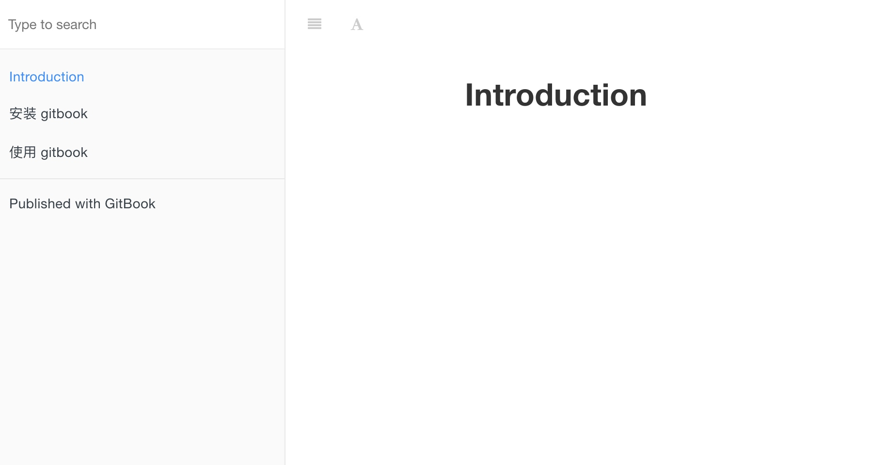

# 使用 gitbook 创建书籍

## 创建书籍框架

可以使用`gitbook init`命令初始化书籍。首先在终端中进入意欲创建书籍的文件夹，如`testbook`，输入如下命令，初始化gitbook。

```
$ gitbook inti
```

执行完成后，你会看到多了两个文件：`README.md`和`SUMMARY.md`文件。这两个文件的作用如下：

> README.md —— 书籍的介绍写在这个文件里
> SUMMARY.md —— 书籍的目录结构在这里配置

此时，我们就可以使用文本编辑器编辑这两个文件了。

首先编辑 `SUMMARY.md` 文件，内容修改为：
```
# SUMMARY

- [前言](README.md)

- [第一章](Chapter1/README.md)

  - [第1节：衣](Chapter1/衣.md)
  - [第2节：食](Chapter1/食.md)
  - [第3节：住](Chapter1/住.md)
  - [第4节：行](Chapter1/行.md)

- [第二章](Chapter2/README.md)

- [第三章](Chapter3/README.md)

- [第四章](Chapter4/README.md)
```
  
  然后我们回到终端，在 `testbook` 文件夹中再次执行 `gitbook init `命令。GitBook 便会查找 `SUMMARY.md` 文件中描述的目录和文件，如果本目录中没有这些文件则会将其创建。

## 书写
至此，你可以打开相应的 markdown 文件，撰写书籍各个章节的内容。
> **使用 git 进行版本控制**
> 在 `testbook` 目录下执行 `git init` 初始化仓库，执行` git remote add` 添加远程仓库（你需要先在远端建好）。
> 之后就可以使用 git 进行书稿撰写的版本控制了。

## 预览书籍
接着我们执行如下命令来预览书籍：
```
gitbook serve
```
执行该命令后会对 Markdown 格式的文档进行转换，默认转换为 html 格式，最后提示 “Serving book on http://localhost:4000”。 打开浏览器就能看的书籍在线的样式。
serve 命令也可以指定端口：
```
$ gitbook serve --port 2333
```


##  建构书籍
当你撰写完毕时，可以执行如下命令建构书籍：
```
$ gitbook build
``` 
默认将生成的静态网站输出到 _book 目录。实际上，这一步也包含在 gitbook serve 里面，因为它们是 HTML，所以 GitBook 通过 Node.js 给你提供服务了。 

你可以通过如下命令可以指定建构书籍的路径：

```
$ gitbook build [书籍路径] [输出路径]
```
## 生成电子书
你还可以生成 PDF 格式的电子书：
```
$ gitbook pdf ./ ./mybook.pdf
```

　　生成 epub 格式的电子书：
```
$ gitbook epub ./ ./mybook.epub
```
　　生成 mobi 格式的电子书：
```
$ gitbook mobi ./ ./mybook.mobi
```
　如果生成不了，你可能还需要安装一些工具，比如 ebook-convert。或者在 Typora 中安装 Pandoc 进行导出。

　